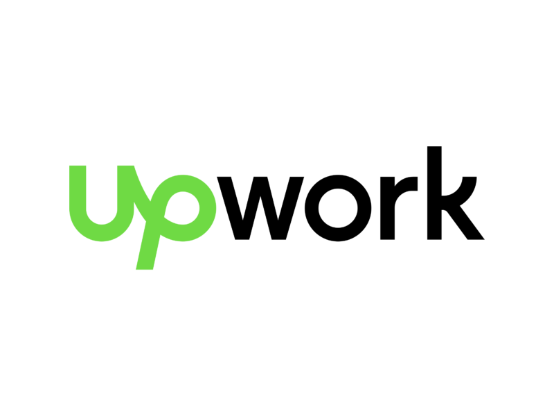
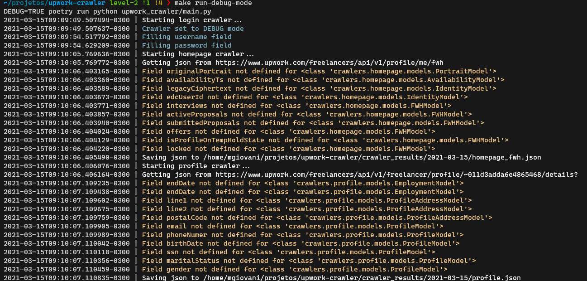
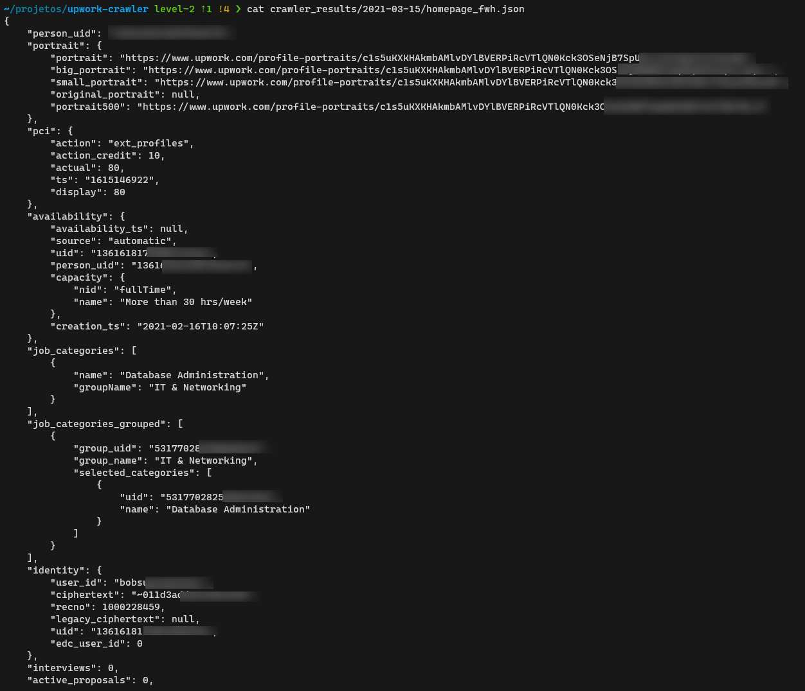
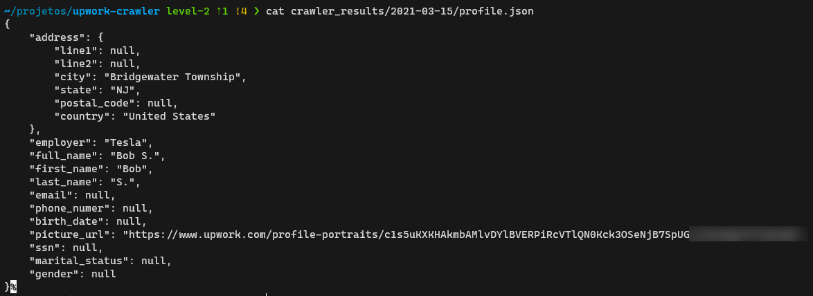

<!-- PROJECT SHIELDS -->
[![Contributors][contributors-shield]][contributors-url]
[![Forks][forks-shield]][forks-url]
[![Stargazers][stars-shield]][stars-url]
[![Issues][issues-shield]][issues-url]
[![MIT License][license-shield]][license-url]
[![LinkedIn][linkedin-shield]][linkedin-url]


<!-- PROJECT LOGO -->
<br />
<p align="center">
  <a href="https://github.com/mgiovani/upwork-crawler">
    
  </a>

  <h3 align="center">Upwork Crawler</h3>

  <p align="center">
    A simple web crawler to get employment data from Upwork.
    <br />
    <br />
    <a href="https://github.com/mgiovani/upwork-crawler/tree/main/docs">View Examples</a>
    ·
    <a href="https://github.com/mgiovani/upwork-crawler/issues">Report Bug</a>
    ·
    <a href="https://github.com/mgiovani/upwork-crawler/issues">Request Feature</a>
  </p>
</p>


<!-- TABLE OF CONTENTS -->
<details open="open">
  <summary><h2 style="display: inline-block">Table of Contents</h2></summary>
  <ol>
    <li>
      <a href="#about-the-project">About The Project</a>
      <ul>
        <li><a href="#built-with">Built With</a></li>
      </ul>
    </li>
    <li>
      <a href="#getting-started">Getting Started</a>
      <ul>
        <li><a href="#prerequisites">Prerequisites</a></li>
        <li><a href="#installation">Installation</a></li>
      </ul>
    </li>
    <li><a href="#usage">Usage</a></li>
    <li><a href="#roadmap">Roadmap</a></li>
    <li><a href="#contributing">Contributing</a></li>
    <li><a href="#license">License</a></li>
    <li><a href="#contact">Contact</a></li>
  </ol>
</details>


<!-- ABOUT THE PROJECT -->
## About The Project




### Built With

* [Selenium](https://selenium-python.readthedocs.io/)
* [Poetry](https://python-poetry.org/docs/)
* [Pydantic](https://pydantic-docs.helpmanual.io/)


<!-- GETTING STARTED -->
## Getting Started

To get a local copy up and running follow these simple steps.

### Prerequisites

This are the preqrequisites you need to install to run this project.
* [Selenium drivers](https://selenium-python.readthedocs.io/installation.html#drivers)
* [Python 3.9+](https://www.python.org/downloads/release/python-390/)

If you want to run this project with Docker, you will need:
* [Docker](https://www.docker.com/)
* [Docker-compose](https://docs.docker.com/compose/install/)


### Installation

1. Clone the repo
   ```sh
   git clone https://github.com/mgiovani/upwork-crawler.git
   ```
2. Running locally:
    1. Install dependencies
       ```sh
       make install
       ```
    2. Edit credentials inside the .env file
       ```sh
       vim .env
       ```
    3. Load the .env file
       ```sh
       source .env
       ```
    4. Run the code
       ```sh
       make run
       ```
       or debug mode to activate the non headless mode of selenium:
       ```sh
       make run-debug-mode
       ```
3. Running with Docker:
    1. Copy env.example
       ```sh
       cp env.example .env
       ```
    2. Edit credentials inside the .env file
       ```sh
       vim .env
       ```
    3. Load the .env file
       ```sh
       source .env
       ```
    4. Run the code
       ```sh
       make run-docker-mode
       ```

## Usage

Check some examples of the project:

Running the project:
<details>
  <summary>Click to show</summary>
  
  
 
</details>

Output from homepage crawler:
<details>
  <summary>Click to show</summary>
  
  
 
</details>

Output from profile crawler:
<details>
  <summary>Click to show</summary>
  
  
 
</details>


<!-- ROADMAP -->
## Roadmap

See the [open issues](https://github.com/mgiovani/upwork-crawler/issues) for a list of proposed features (and known issues).


<!-- CONTRIBUTING -->
## Contributing

Contributions are what make the open source community such an amazing place to be learn, inspire, and create. Any contributions you make are **greatly appreciated**.

1. Fork the Project
2. Create your Feature Branch (`git checkout -b feature/AmazingFeature`)
3. Commit your Changes (`git commit -m 'Add some AmazingFeature'`)
4. Push to the Branch (`git push origin feature/AmazingFeature`)
5. Open a Pull Request


## License

Distributed under the MIT License. See `LICENSE` for more information.


## Contact

Giovani Moutinho - [Linkedin](https://www.linkedin.com/in/mgiovani/)

Project Link: [https://github.com/mgiovani/upwork-crawler](https://github.com/mgiovani/upwork-crawler)


[contributors-shield]: https://img.shields.io/github/contributors/mgiovani/upwork-crawler.svg?style=for-the-badge
[contributors-url]: https://github.com/mgiovani/upwork-crawler/graphs/contributors
[forks-shield]: https://img.shields.io/github/forks/mgiovani/upwork-crawler.svg?style=for-the-badge
[forks-url]: https://github.com/mgiovani/upwork-crawler/network/members
[stars-shield]: https://img.shields.io/github/stars/mgiovani/upwork-crawler.svg?style=for-the-badge
[stars-url]: https://github.com/mgiovani/upwork-crawler/stargazers
[issues-shield]: https://img.shields.io/github/issues/mgiovani/upwork-crawler.svg?style=for-the-badge
[issues-url]: https://github.com/mgiovani/upwork-crawler/issues
[license-shield]: https://img.shields.io/github/license/mgiovani/upwork-crawler.svg?style=for-the-badge
[license-url]: https://github.com/mgiovani/upwork-crawler/blob/master/LICENSE.txt
[linkedin-shield]: https://img.shields.io/badge/-LinkedIn-black.svg?style=for-the-badge&logo=linkedin&colorB=555
[linkedin-url]: https://linkedin.com/in/mgiovani
